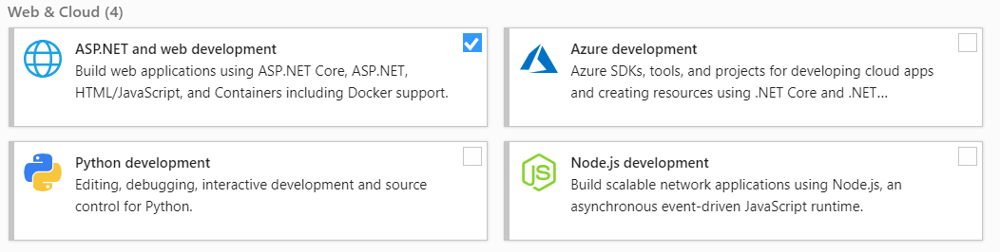

## How to update Visual Studio 2019 with all necessary features ⭐
1. Run Visual Studio Installer ( Search for Visual Studio Installer in your start menu )

2. Might need to update the installer
3. Modify your version of Visual Studio by clicking Modify
	* If there is an Update button instead of modify, click update
	* Visual studio will update to the latest version and after that the modify button will be shown
	* You can also modify without update

4. Check the following features if they are not already checked:

	
5. Click the Modify button

7. Wait for the installation to finish
